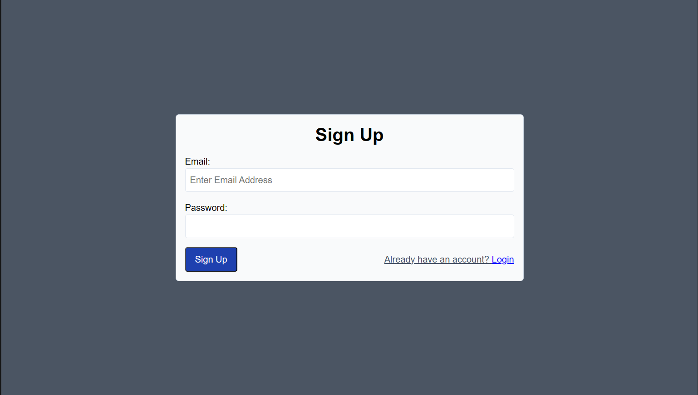
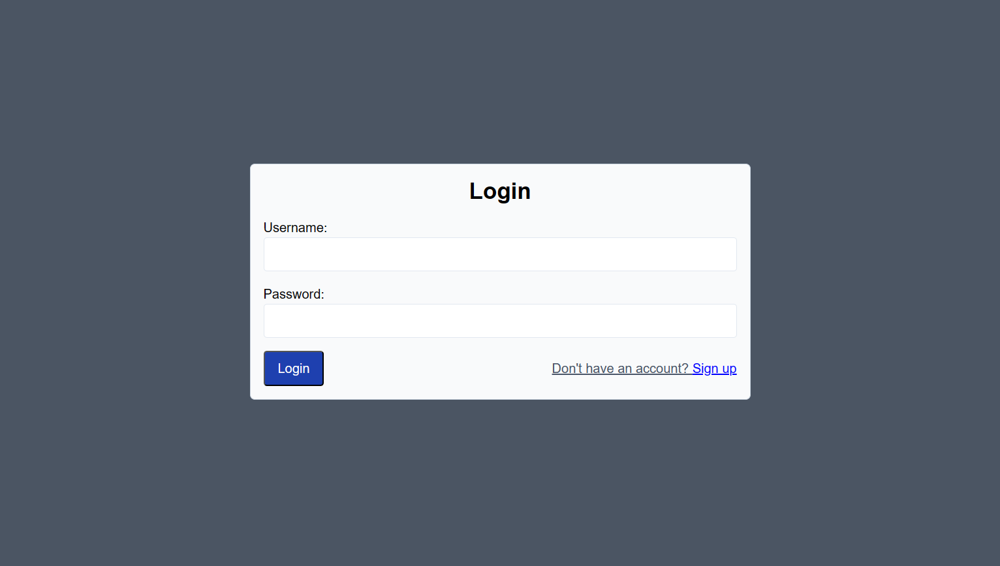
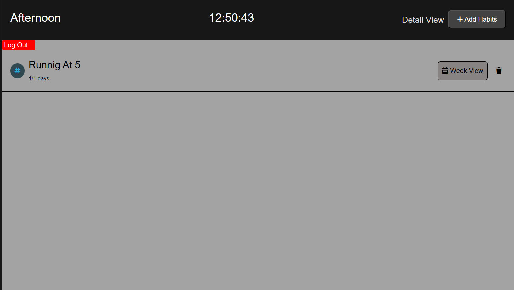
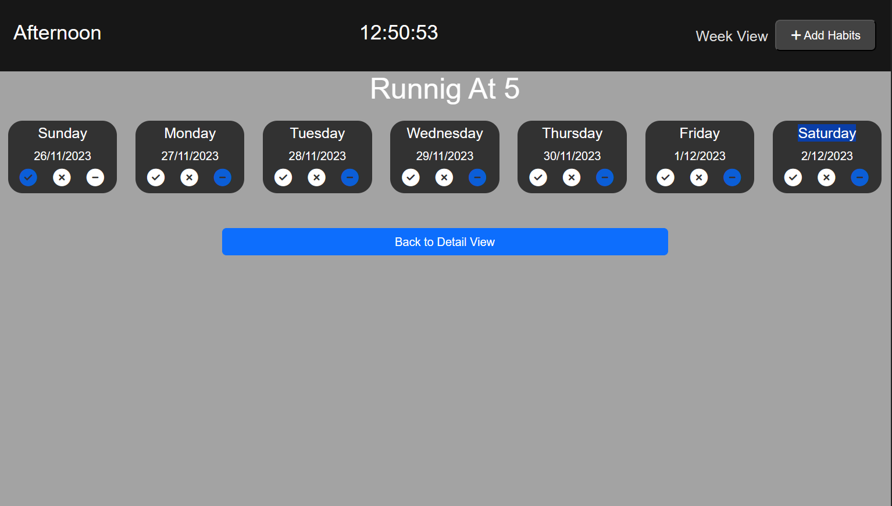

# Kratin App - Habit Tracker for a Healthier Life

## Overview

**Kratin App** is a habit tracker application designed to help users, especially individuals aged 65 and above, live a healthier and better life. The application enables users to sign up and log in using their respective email IDs. Once logged in, users can seamlessly add habits to their routine, manage them in a week view, and mark habits as done, undone, or none.

The app utilizes local storage to ensure that user data persists across sessions, allowing multiple users to sign up and manage their tasks independently. Additionally, the Context API is employed for robust state management, ensuring that user data remains intact even when the browser is closed, until explicitly removed from local storage.

## Features

### 1. User Authentication

- **Signup and Login:** Users can sign up with their email IDs and log in securely to access the habit tracking features.

### 2. Habit Tracking

- **Add Habits:** Users can add habits to their routine, specifying details such as habit name, frequency, and any additional notes.

- **Week View:** The application provides a week view, allowing users to organize and visualize their habits throughout the week.

- **Mark Habits:** Users can mark habits as done, undone, or none, providing a simple and effective way to track their progress.

### 3. Persistence and State Management

- **Local Storage:** User data is stored locally, ensuring that habits and user information persist across browser sessions.

- **Context API:** The Context API is employed for state management, maintaining the integrity of user data even when the browser is closed.

## Deployment

- **Local Development:** To run the Kratin App locally, clone the repository, navigate to the project directory, install dependencies with `npm install`, and start the application with `npm start`. Visit [http://localhost:5173](http://localhost:5173) to explore the app locally.

- **Online Deployment:** The Kratin App is also hosted on Vercel. Users can access it through the following link: [Kratin App on Vercel](https://kratin-software.vercel.app/).

## Problem Statement

The application addresses the challenge of promoting a healthier lifestyle for individuals like Sunita Sharma, aged 65 and above. It offers a solution to help manage daily tasks, physical and mental activities, diet, and medication through a user-friendly habit tracking interface.

## Future Scope

The Kratin App has the potential for further enhancements and improvements, including:

- **Alerts and Reminders:** Implementing alerts and text messages to remind users of incomplete tasks or upcoming habits.

- **Persisting To-Do List:** Enhancing the application by persisting the to-do list in local storage using JSON methods for improved data management.

- **User-Friendly Animations:** Integrating animations, such as using react-toast, to create a more engaging and user-friendly experience.

## Code Summary

The React.js-based code for Kratin App includes components for a habit tracker with features like adding, marking completion, and deleting habits. The code utilizes React's component-based architecture, state management with the Context API, and local storage for persistent user data.

## How to Run

To run the Kratin App locally:

1. Clone the repository: `git clone https://github.com/your-username/kratin-app.git`
2. Navigate to the project directory: `cd kratin-app`
3. Install dependencies: `npm install`
4. Start the application: `npm start`

Visit [http://localhost:5173](http://localhost:5173) in your browser to explore the Kratin App and start tracking your habits for a healthier life!

